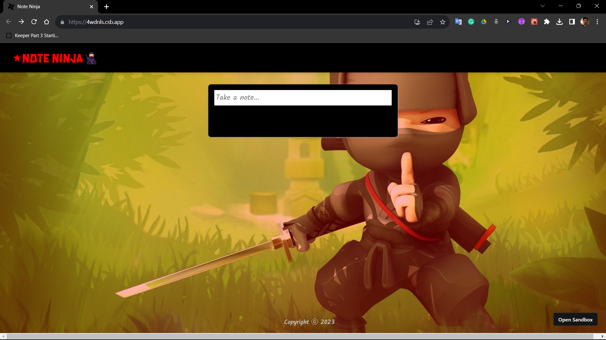
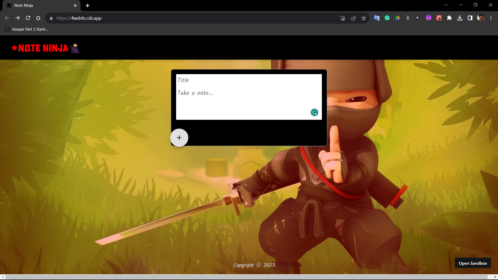
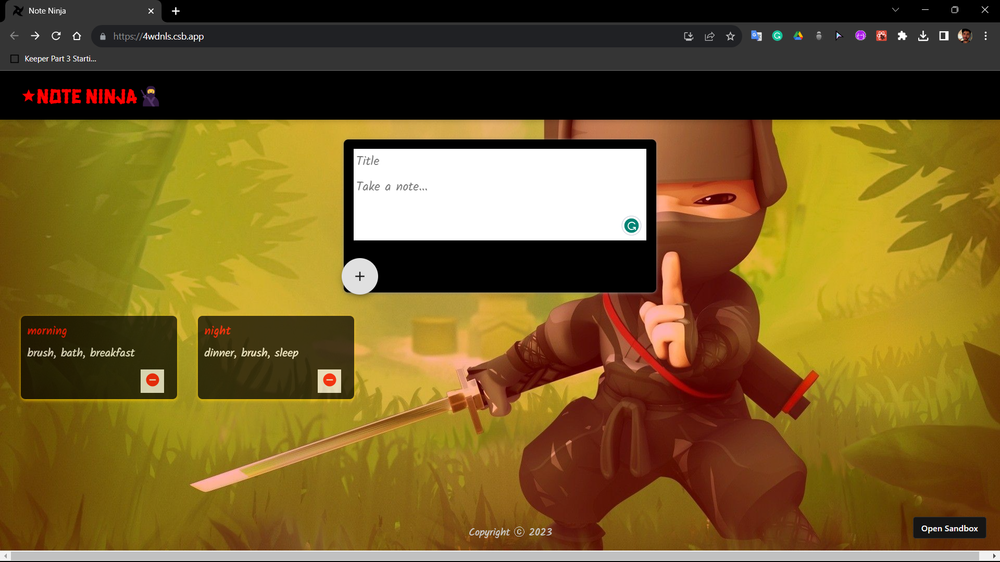

# Note Ninja - Your Ultimate Reminder App





Note Ninja is a simple yet powerful reminder app built with HTML, CSS, React.js, and JavaScript. Stay organized and never forget your important tasks and plans with Note Ninja. This README provides an overview of the app's features and how to use them effectively.

## Features

- **Add Title:** Easily add a title to your task or reminder. This title serves as a quick reference for your task.

- **Add Content:** Add detailed content or description for your task. You can use this space to jot down steps required to achieve the task, important notes, or any other relevant information.

- **Delete:** Delete both the title and content of a task with a single click. This feature helps you manage your reminders efficiently.

## Demo

Check out a live demo of Note Ninja [here](https://4wdnls.csb.app/)!

## Getting Started

To get started with Note Ninja, follow these steps:

1. Clone this repository to your local machine:

   ```bash
   git clone https://github.com/your-username/note-ninja.git
   
2. Navigate to the project directory:

   ```bash
   cd note-ninja

3. Install the required dependencies:

    ```bash
    npm install

4. Start the development server:

   ```bash
   npm start

5. Open your web browser and access Note Ninja at [here](http://localhost:3000)!

## Usage

1. Adding a Task:
   
   - Click on the "Add Title" button to create a new task.
   - Enter a title for your task in the provided input field.
   - Click on the "Add Content" button to add a description or steps required for the task.

2. Editing a Task:

    - To edit the title or content of a task, simply click on the task card you want to edit.
    - Make your changes in the respective input fields.
    - Click the "Save" button to save your changes.

3. Deleting a Task:

   - To delete a task and its content, click the "Delete" button on the task card. This action 
     is irreversible, so use it with caution.

## Contributing:
We welcome contributions from the community! If you have ideas for new features, bug fixes, or improvements, please open an issue or create a pull request. For guidelines on contributing, please check the CONTRIBUTING.md file.

## Contact:
If you have any questions or feedback, feel free to reach out to us at [here](quicksilver92571331@gmail.com)!.

Happy note-taking with Note Ninja! 📝✨
